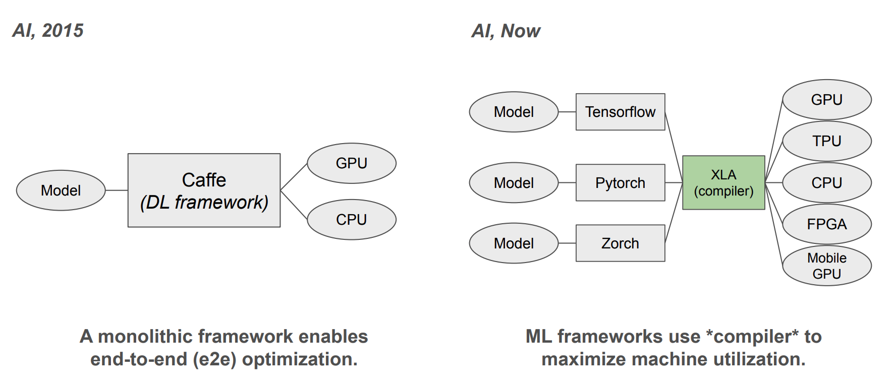
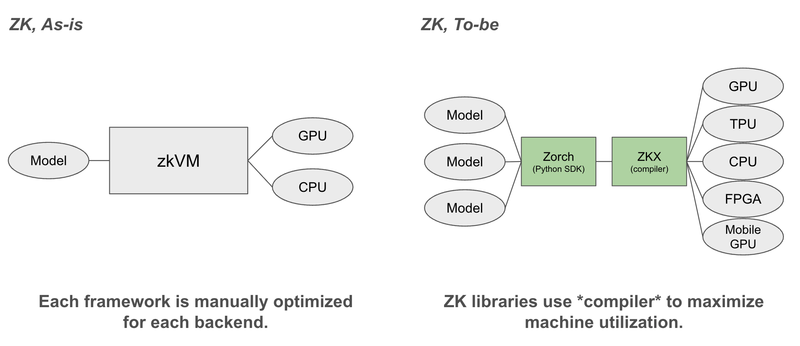
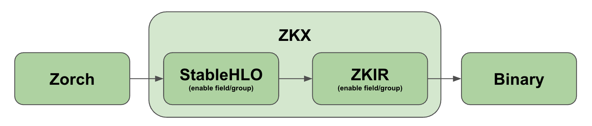

  <picture>
    <source media="(prefers-color-scheme: dark)" srcset="./assets/fractalyze-logo-white.svg" />
    <source media="(prefers-color-scheme: light)" srcset="./assets/fractalyze-logo-black.svg" />
    
  </picture>

 

**[Fractalyze] is the computing layer for cryptography.** We build, optimize, and operate production cryptography systems, transforming trust-based digital systems into cryptographically verifiable infrastructure.

Advanced cryptography is moving from research into production, powering privacy, verifiable computation, and trust-minimized systems. It is still out of reach for most teams: the computation is orders of magnitude too expensive, and the engineering that makes it cheap is specialized, manual, and slow. This organization hosts the stack we built to close that gap — a Python frontend ([Zorch]), field-native primitives ([FRX][hash-frx]), and a compiler ([ZKX], [PrimeIR]) that lowers both into optimized execution for whatever hardware you target.

## From Craft to Compiler

  
   
  

Just as [PyTorch] + [XLA] freed ML engineers from manual GPU tuning, [Zorch] + [ZKX]/[PrimeIR] frees cryptography engineers from manual proving-system engineering.

The optimizations that matter here are global. Lazy reduction and kernel fusion are decisions taken across a whole computation graph, not local rewrites of a snippet — which is why this is a compiler rather than a collection of hand-tuned kernels.

## Core Projects

  

**[Zorch]**: A Python-first frontend for cryptographic computation. Inspired by [PyTorch]'s ergonomics, [Zorch] lets researchers write the frontend — circuits, proving schemes, zkVMs — in intuitive Python, while the compiler stack below generates the optimized backend.

**[ZKX]**: ZKX (ZK Accelerator) is a compiler for cryptographic computation, analogous to [XLA] for machine learning. It optimizes end to end across proving schemes, custom circuits, and zkVMs, automatically targeting multiple hardware backends (GPU, TPU, FPGA, mobile GPU).

**[PrimeIR]**: PrimeIR (Prime Intermediate Representation) is an intermediate language based on **[MLIR]** (Multi-Level Intermediate Representation), dedicated to cryptographic optimization — a level at which `a * b % p` is field arithmetic rather than three integer instructions.

**FRX**: Field-native primitives, each lowering to a single fused kernel — [hashes][hash-frx], with signatures and encryption alongside.

Provers built on this stack, each byte-matched against its reference implementation: [sp1-zorch], [openvm-zorch], [zisk-zorch], [pico-zorch], [groth16-zorch] and [bellman-zorch].

## Learn More

Read the [blog] and the [gitbook], or see what the [compiler] does and what it measures.

## Supported by

  <a href="https://ethereum.foundation">
    <picture>
      <source media="(prefers-color-scheme: dark)" srcset="./assets/ef-logo-light.svg" />
      <source media="(prefers-color-scheme: light)" srcset="./assets/ef-logo-dark.svg" />
      
    </picture>
  </a>
  &nbsp;&nbsp;&nbsp;&nbsp;&nbsp;&nbsp;&nbsp;&nbsp;
  

<!-- Reference Links -->
[Fractalyze]: https://fractalyze.io
[ZKX]: https://fractalyze.io/compiler
[PrimeIR]: https://github.com/fractalyze/prime-ir
[Zorch]: https://github.com/fractalyze/zorch
[hash-frx]: https://github.com/fractalyze/hash-frx
[sp1-zorch]: https://github.com/fractalyze/sp1-zorch
[openvm-zorch]: https://github.com/fractalyze/openvm-zorch
[zisk-zorch]: https://github.com/fractalyze/zisk-zorch
[pico-zorch]: https://github.com/fractalyze/pico-zorch
[groth16-zorch]: https://github.com/fractalyze/groth16-zorch
[bellman-zorch]: https://github.com/fractalyze/bellman-zorch
[PyTorch]: https://pytorch.org
[XLA]: https://openxla.org/xla
[MLIR]: https://mlir.llvm.org
[blog]: https://www.fractalyze.io/blog
[gitbook]: https://fractalyze.gitbook.io/intro
[compiler]: https://fractalyze.io/compiler
