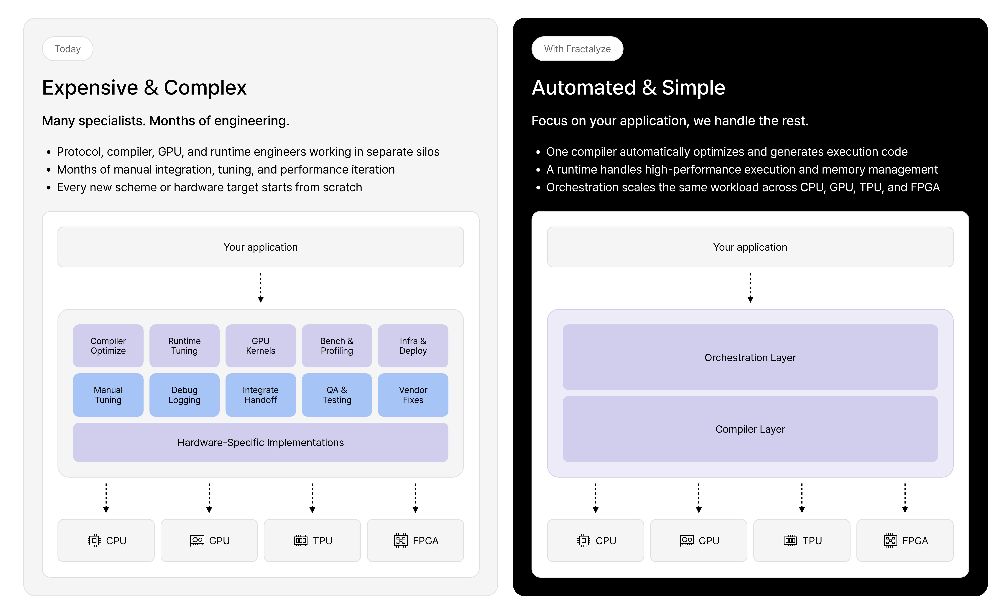
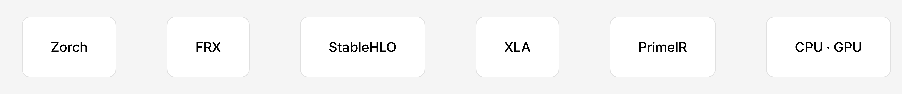
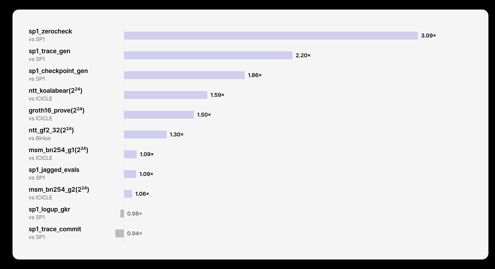
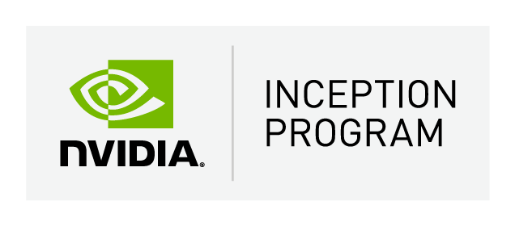

  <picture>
    <source media="(prefers-color-scheme: dark)" srcset="./assets/fractalyze-logo-white.svg" />
    <source media="(prefers-color-scheme: light)" srcset="./assets/fractalyze-logo-black.svg" />
    
  </picture>

 

# The computing layer for cryptography

We build, optimize, and operate production cryptography systems, transforming trust-based digital systems into cryptographically verifiable infrastructure.

## The Computing Layer

A unified platform that automatically transforms high-level cryptographic applications into optimized execution for any target hardware.

<picture>
  <source media="(prefers-color-scheme: dark)" srcset="./assets/computing-layer-dark.png" />
  <source media="(prefers-color-scheme: light)" srcset="./assets/computing-layer-light.png" />
  
</picture>

Today, getting cryptography into production means protocol, compiler, GPU and runtime engineers working in separate silos, months of manual integration and tuning, and starting over for every new scheme or hardware target. We replace that with one compiler that optimizes and generates execution code, a runtime that handles execution and memory, and orchestration that scales the same workload across CPU, GPU, TPU and FPGA.

## The Compiler

Build cryptographic applications in Python. Compile them into highly optimized execution for modern hardware.

<picture>
  <source media="(prefers-color-scheme: dark)" srcset="./assets/pipeline-dark.png" />
  <source media="(prefers-color-scheme: light)" srcset="./assets/pipeline-light.png" />
  
</picture>

**[Zorch]** — Build a SNARK in Python: define your IOP rounds and compose them. You write the protocol, and never touch the kernels.

**FRX** — Fractalyze's fork of JAX. Traces your Python into a graph and lowers it to StableHLO, carrying field types, not floats.

**[XLA]** — Runs a full optimization pipeline over the whole graph, from fusion and layout to lazy reduction, treating it as one program.

**[PrimeIR]** — An [MLIR] layer that lowers the optimized graph into kernels and tunes the generated code for each CPU and GPU target.

The optimizations that matter here are global. Lazy reduction and fusion are decisions taken across a whole computation graph, not local rewrites of a snippet — which is why this is a compiler rather than a collection of hand-tuned kernels.

## Benchmarks

<picture>
  <source media="(prefers-color-scheme: dark)" srcset="./assets/benchmark-dark.png" />
  <source media="(prefers-color-scheme: light)" srcset="./assets/benchmark-light.png" />
  
</picture>

Our speed as a multiple of the baseline's, measured against ICICLE, SP1 and Binius — parity at 1, including the two workloads where we are still behind. Provers built on this stack are byte-matched against their reference implementations. Current figures and what each run measured: [fractalyze.io/compiler][compiler].

---

Read the [blog] and the [docs], or see the whole picture at [fractalyze.io][Fractalyze].

## Supported by

  <a href="https://ethereum.foundation">
    <picture>
      <source media="(prefers-color-scheme: dark)" srcset="./assets/ef-logo-light.svg" />
      <source media="(prefers-color-scheme: light)" srcset="./assets/ef-logo-dark.svg" />
      
    </picture>
  </a>
  &nbsp;&nbsp;&nbsp;&nbsp;&nbsp;&nbsp;&nbsp;&nbsp;
  

<!-- Reference Links -->
[Fractalyze]: https://fractalyze.io
[compiler]: https://fractalyze.io/compiler
[Zorch]: https://github.com/fractalyze/zorch
[PrimeIR]: https://github.com/fractalyze/prime-ir
[XLA]: https://openxla.org/xla
[MLIR]: https://mlir.llvm.org
[blog]: https://www.fractalyze.io/blog
[docs]: https://fractalyze.gitbook.io/intro
